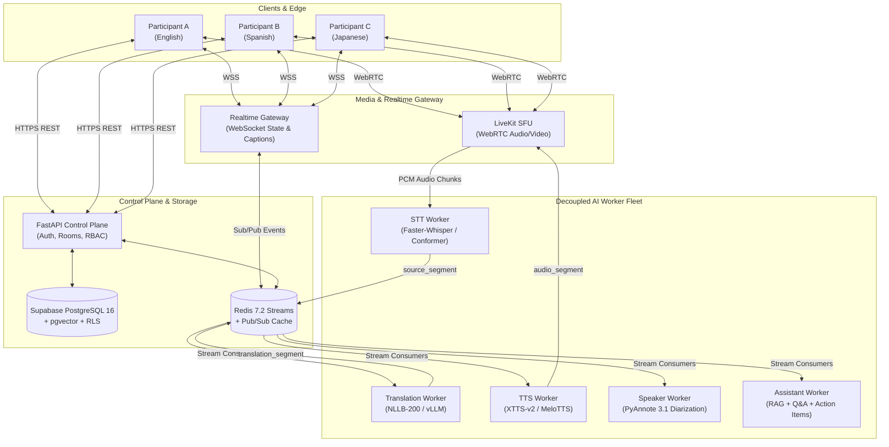

# Multilingual AI Meeting Platform

> **Production-grade real-time multilingual AI meeting platform with personalized language translation, WebRTC video/audio, streaming STT, translation, TTS, AI assistance, and enterprise-grade security.**

[](https://github.com/Aman678317/Anvs-AI/actions)
[](LICENSE)
[](docs/ADR)
[](pyproject.toml)
[](package.json)

---

## 1. System Overview

The **Multilingual AI Meeting Platform** is an enterprise-grade, distributed, real-time collaboration engine designed for global teams speaking diverse languages. The platform captures multi-participant audio and video via WebRTC, streams speech to an ultra-low-latency Speech-to-Text (STT) pipeline, translates dialogue across dynamic language pairs in real time, and synthesizes localized speech (TTS) delivered directly into each participant's personalized audio stream.



---

## 2. Non-Negotiable Architecture Invariants

1. **Original Human Audio Independence**: Original raw participant audio is preserved in unmutated form. Translated synthetic audio streams are published on dedicated, participant-scoped tracks.
2. **Immutable Source Lineage**: Every emitted caption, translation, or synthesized voice packet maintains cryptographically verifiable lineage back to its root `source_segment_id`.
3. **Synthetic Audio Loop Rejection**: All synthesized TTS audio streams are encoded with an imperceptible **20 kHz acoustic watermark**. The STT ingestion pipeline inspects incoming frames and drops watermarked audio, preventing hallucinated translation feedback loops.
4. **Participant-Scoped Listening Preferences**: Translation is personalized per participant. User A can listen to Japanese while User B listens to Spanish for the exact same speaker segment.
5. **Zero-Trust Multi-Tenancy**: Tenant isolation is strictly enforced at the database level using PostgreSQL Row-Level Security (`FORCE ROW LEVEL SECURITY`) bound to authenticated JWT tenant claims.

---

## 3. Technology Stack

| Layer                 | Technology                                                | Key Capabilities                                              |
| :-------------------- | :-------------------------------------------------------- | :------------------------------------------------------------ |
| **Web Frontend**      | Next.js 14 (App Router), TypeScript, TailwindCSS, Zustand | Server components, LiveKit Client SDK, optimistic UI updates  |
| **Control Plane**     | FastAPI 0.111+, Python 3.11, Pydantic v2, SQLAlchemy 2.0  | Async IO, OpenAPI schemas, Supabase Auth integration          |
| **Media Server**      | LiveKit SFU (Go), WebRTC                                  | Selective Forwarding Unit, simulcast, adaptive bitrate        |
| **Realtime Gateway**  | WebSocket, Redis Pub/Sub, asyncio                         | Sub-50ms caption distribution, presence, room events          |
| **Database**          | PostgreSQL 16 (Supabase), pgvector, pg_stat_statements     | RLS, vector semantic search for meeting transcripts           |
| **Event Bus & Cache** | Redis 7.2 (Redis Streams, Pub/Sub, Sentinel)              | High-throughput durable audio and text event streaming        |
| **Speech-to-Text**    | Faster-Whisper, Conformer, Silero VAD                     | Chunked streaming transcription, Voice Activity Detection     |
| **Translation**       | Meta NLLB-200-distilled-600M, vLLM                        | 200+ language support, contextual sliding window              |
| **Text-to-Speech**    | Coqui XTTS-v2, MeloTTS                                    | Low-latency voice cloning, emotion preservation               |
| **Diarization**       | PyAnnote Audio 3.1                                        | Real-time speaker embedding clustering and identification     |
| **Observability**     | OpenTelemetry 1.44, Prometheus, Grafana, Jaeger           | Distributed tracing across WebRTC, API, Redis, and AI workers |

---

## 4. Repository Structure

This monorepo is organized according to the **Document 14 Production Implementation Blueprint**:

```
.
├── apps/                               # User-facing applications
│   ├── web/                            # Next.js 14 Main Meeting Application
│   ├── admin/                          # Next.js 14 Enterprise Admin Portal
│   └── meeting-client/                 # Headless WebRTC / SDK client
├── services/                           # Backend services & AI workers
│   ├── api/                            # FastAPI Control Plane (REST & Auth)
│   ├── realtime-gateway/               # WebSocket Gateway (State & Events)
│   ├── orchestrator/                   # Realtime Pipeline Coordinator
│   ├── stt-worker/                     # Streaming Speech-to-Text Service
│   ├── translation-worker/             # Streaming Neural Machine Translation Service
│   ├── tts-worker/                     # Streaming Text-to-Speech Service
│   ├── speaker-worker/                 # Diarization & Speaker ID Service
│   ├── voice-worker/                   # Voice Cloning & Acoustic Watermarking
│   └── assistant-worker/               # RAG, Meeting Summary & Action Item Service
├── packages/                           # Shared internal libraries
│   ├── contracts/                      # Pydantic & TypeScript REST/WS schemas
│   ├── event-schema/                   # Redis Streams event definitions
│   ├── language-registry/              # ISO-639-3 Registry & Tier matrices
│   ├── auth/                           # JWT, RBAC & Supabase Auth utilities
│   ├── database/                       # SQLAlchemy models & Alembic migrations
│   ├── observability/                  # OpenTelemetry tracing & Prometheus metrics
│   ├── audio/                          # PCM frame manipulation & 20 kHz watermark
│   └── config/                         # Unified configuration and validation
├── infrastructure/                     # Infrastructure as Code & Orchestration
│   ├── docker/                         # Dockerfiles for multi-stage production builds
│   ├── livekit/                        # LiveKit SFU configuration & egress templates
│   └── monitoring/                     # Prometheus, Grafana, & OTel Collector configs
├── tests/                              # Comprehensive test suites
│   ├── unit/                           # Isolated unit tests
│   ├── integration/                    # Multi-component integration tests
│   ├── contract/                       # OpenAPI & AsyncAPI contract tests
│   ├── realtime/                       # WebRTC audio & WebSocket stress tests
│   ├── ai/                             # STT WER, BLEU/COMET & TTS MOS evaluations
│   ├── e2e/                            # Playwright end-to-end user journey tests
│   ├── load/                           # Locust load & concurrent room benchmarks
│   └── security/                       # Bandit, OWASP ZAP & RLS leakage verification
├── docs/                               # Engineering documentation & ADRs
│   ├── ADR/                            # Architecture Decision Records
│   ├── API/                            # REST & WebSocket contract specifications
│   ├── EVENTS/                         # Event Bus & Redis Streams specifications
│   ├── SECURITY/                       # Threat models & security controls
│   └── RUNBOOKS/                       # SRE incident response & deployment runbooks
├── .github/workflows/                  # GitHub Actions CI/CD workflows
├── docker-compose.yml                  # Local development multi-service stack
├── Makefile                            # Standard developer task runner
├── package.json                        # Monorepo root Node.js configuration
├── pnpm-workspace.yaml                 # PNPM monorepo configuration
└── pyproject.toml                      # Root Python toolchain & linting configuration
```

---

## 5. Quickstart & Local Development

### Prerequisites

- **Node.js**: `v20.x+` (LTS) & **pnpm**: `v9.x+`
- **Python**: `3.11.x+` & **uv** or **poetry**
- **Docker**: `24.x+` and Docker Compose
- **Git** with SSH configured

### 1. Clone & Configure Environment

```bash
git clone git@github.com:Aman678317/Anvs-AI.git
cd Anvs-AI

# Create local environment configuration
cp .env.example .env
```

### 2. Start Supporting Infrastructure

Launch PostgreSQL 16 (pgvector), Redis 7.2, LiveKit SFU, and OpenTelemetry Collector:

```bash
make up
```

### 3. Install Dependencies

```bash
make install
```

### 4. Run Migrations

```bash
make db-migrate
```

### 5. Start Development Servers

```bash
make dev
```

- **Web App**: `http://localhost:3000`
- **Control Plane API**: `http://localhost:8000/docs`
- **WebSocket Gateway**: `ws://localhost:8001/ws`
- **LiveKit SFU**: `ws://localhost:7880`
- **Jaeger Tracing**: `http://localhost:16686`

---

## 6. Development Commands

Universal commands are provided via the `Makefile`:

```bash
make help            # List all available targets
make install         # Install all Node and Python dependencies
make up              # Start local Docker infrastructure (Postgres, Redis, LiveKit)
make down            # Stop local Docker infrastructure
make dev             # Start web frontend and backend services in watch mode
make lint            # Run Ruff, ESLint, and Prettier checks
make format          # Auto-format Python and TypeScript code
make typecheck       # Run Mypy and TypeScript compiler checks
make test            # Execute unit and integration tests across all services
make test-ai         # Run speech & translation benchmark test suites
make clean           # Remove temporary artifacts, caches, and build outputs
```

---

## 7. Git & Commit Conventions

This project strictly follows the **Conventional Commits** specification:

- `feat(scope)`: A new feature
- `fix(scope)`: A bug fix
- `refactor(scope)`: Code change that neither fixes a bug nor adds a feature
- `perf(scope)`: A code change that improves performance
- `test(scope)`: Adding missing tests or correcting existing tests
- `docs(scope)`: Documentation changes only
- `chore(scope)`: Changes to the build process or auxiliary tools

PR workflow follows the structured 20-PR sequence specified in **Document 14 (Production Coding Implementation Blueprint)**.

---

## 8. Security & Compliance

- **No Secrets in Code**: Environment variables and credentials must strictly be managed via `.env` files (ignored by Git) or AWS/Vault secret managers.
- **Row-Level Security**: Every Supabase / Postgres table enforcing multi-tenancy has RLS enabled with `RESTRICTIVE` policies.
- **Watermarked TTS**: Prevents audio loops and unauthorized deepfake voice abuse.
- **Vulnerability Scanning**: Automated scanning via Bandit, Snyk, and GitHub CodeQL runs on every pull request.
