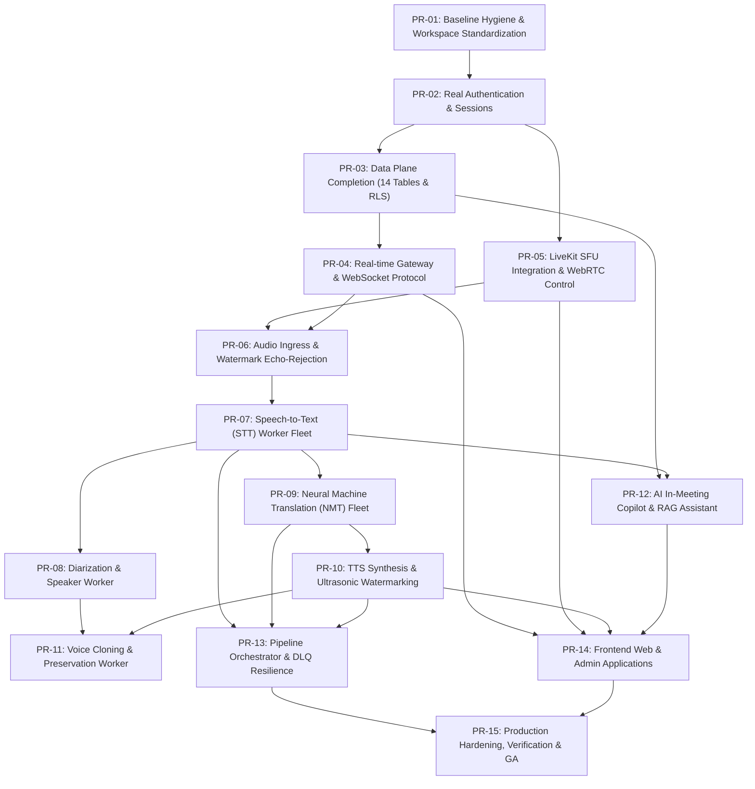

# ANVS-AI Multilingual Meeting Platform — Dependency Graph (Phase 0)

> **Document**: `docs/audit/DEPENDENCY_GRAPH.md`  
> **Author**: Lead Principal Software Engineer & Architecture Team  
> **Date**: September 22, 2026  
> **Purpose**: Complete topological analysis of system components, runtime media & data pipelines, package dependencies, and PR critical path sequencing.

---

## 1. Runtime Media & Data Plane Pipeline Flow

```mermaid
flowchart TD
    subgraph ClientBrowser["Client Web Browser (apps/web)"]
        UserMic["Microphone Audio (48kHz WebRTC)"]
        UserSpk["Speaker / Headphones"]
        UserUI["Web UI (Video / Captions / Chat)"]
    end

    subgraph MediaPlane["Media Plane (LiveKit SFU)"]
        LKSFU["LiveKit SFU Server (Port 7880)"]
    end

    subgraph AudioIngress["Audio Ingress & Protection (packages/audio, PR-05/06)"]
        LKSub["LiveKit Audio Track Subscriber"]
        Chunker["20ms Chunker (960 samples @ 48kHz)"]
        Resampler["Resampler (48kHz -> 16kHz)"]
        WatermarkDetector{"20 kHz Ultrasonic Watermark?"}
        DropLoop["Drop Audio Frame (Invariant #3: Echo Prevention)"]
        VAD["Voice Activity Detector (Energy/Silero VAD)"]
    end

    subgraph EventPlane["Event Transport & Storage Plane (Redis 7.2 Streams)"]
        StreamAudio["meeting:{id}:audio"]
        StreamTranscripts["meeting:{id}:transcripts"]
        StreamTranslations["meeting:{id}:translations"]
        StreamTTS["meeting:{id}:tts"]
        StreamDLQ["meeting:{id}:dlq (Invariant #4)"]
    end

    subgraph AIFleet["AI Worker Fleet (services/)"]
        STTWorker["STT Worker (services/stt_worker, PR-07)"]
        SpeakerWorker["Speaker Diarization Worker (services/speaker_worker, PR-08)"]
        NMTWorker["Translation Worker (services/translation_worker, PR-09)"]
        TTSWorker["TTS Worker (services/tts_worker, PR-10)"]
        VoiceWorker["Voice Preservation Worker (services/voice_worker, PR-11)"]
        AssistantWorker["AI Copilot / RAG Worker (services/assistant_worker, PR-12)"]
    end

    subgraph DataPlane["Durable Storage Plane (PostgreSQL 16 + pgvector)"]
        PostgresDB[("PostgreSQL 16\n(RLS Enforced, 14 Tables)")]
        HNSWIndex[("pgvector HNSW Index\n(1536-dim Cosine Ops)")]
    end

    subgraph RealtimeGateway["Real-time Signaling (services/realtime_gateway, PR-04)"]
        WSGateway["WebSocket Gateway (Port 8001)"]
        RedisPubSub["Redis Pub/Sub Event Fanout"]
    end

    %% Media Audio Ingress Connections
    UserMic -->|WebRTC Publish| LKSFU
    LKSFU -->|Track Subscription| LKSub
    LKSub --> Chunker
    Chunker --> Resampler
    Resampler --> WatermarkDetector
    WatermarkDetector -->|Watermark Detected (Synthetic)| DropLoop
    WatermarkDetector -->|Clean (Human Speech)| VAD
    VAD -->|Speech Chunks| StreamAudio

    %% AI Pipeline Connections
    StreamAudio --> STTWorker
    STTWorker -->|SourceSegmentEvent\n(source_segment_id)| StreamTranscripts
    StreamTranscripts --> SpeakerWorker
    StreamTranscripts --> NMTWorker
    StreamTranscripts --> PostgresDB
    StreamTranscripts --> HNSWIndex

    %% Translation & TTS
    NMTWorker -->|TranslationSegmentEvent\n(source_segment_id preserved)| StreamTranslations
    StreamTranslations --> TTSWorker
    VoiceWorker -.->|Voice Embedding| TTSWorker
    TTSWorker -->|20 kHz Watermark Added| StreamTTS

    %% Audio Egress Back to SFU
    StreamTTS -->|WebRTC Track Publish| LKSFU
    LKSFU -->|Targeted Audio Sub| UserSpk

    %% Real-time Subscriptions for Captions & UI
    StreamTranscripts --> RedisPubSub
    StreamTranslations --> RedisPubSub
    RedisPubSub --> WSGateway
    WSGateway -->|WSServerMessageType.CAPTION| UserUI

    %% Assistant Copilot RAG
    UserUI -->|WSChatMessage / Prompt| WSGateway
    WSGateway --> AssistantWorker
    HNSWIndex -.->|Transcript Provenance Search| AssistantWorker
    AssistantWorker -->|AssistantResponseEvent| RedisPubSub
```

---

## 2. Package Dependency Hierarchy

```
packages/config (Settings, Env Variables)
      ▲
      │
packages/observability (OpenTelemetry, Prometheus, Logger)
      ▲
      │
packages/contracts (Python & TypeScript Event Schemas, REST Models)
      ▲
      │
packages/event_schema (Redis Streams Bus, Stream Keys, Event Envelope)
      ▲
      ├──────────────────────┬──────────────────────┐
      │                      │                      │
packages/database      packages/security      packages/audio
(SQLAlchemy 2.0, RLS,  (Crypto, Passwords,    (Framing, Resampling,
 pgvector, Session)     Sanitizer, Token Dec)  VAD, Watermarking)
      ▲                      ▲                      ▲
      │                      │                      │
packages/auth (JWT Tokens, RBAC, AuthenticatedUser context)
      ▲
      ├──────────────────────┬──────────────────────┬──────────────────────┐
      │                      │                      │                      │
services/api           services/realtime_     services/orchestrator  services/ai_workers
(FastAPI Control        gateway (WebSocket     (DLQ, Health, Worker   (STT, NMT, TTS,
 Plane, Room Router)    Signaling & Captions)   Coordination)          Speaker, Voice, Copilot)
      ▲                      ▲
      │                      │
    apps/web               apps/admin
    (Next.js Client)       (Next.js Admin)
```

---

## 3. Pull Request Critical Path & Blocker Sequence

The implementation roadmap PR-01 through PR-15 has strict predecessor dependencies:



### Dependency Rules & Invariants
1. **Security Precedence**: PR-02 (Authentication) and PR-03 (PostgreSQL RLS) must precede PR-04/PR-05 to prevent unauthenticated access or cross-tenant data leaks.
2. **Lineage Precedence (Invariant #2)**: PR-06 and PR-07 establish the canonical `source_segment_id` before PR-09 (Translation) and PR-10 (TTS) consume it.
3. **Echo Prevention Precedence (Invariant #3)**: PR-06 (Watermark detection & frame dropping) must be operational before PR-10 (TTS synthetic audio injection) publishes audio back into the WebRTC room.
4. **Resilience & Verification Precedence (Invariant #4)**: PR-13 validates the DLQ quarantine before PR-15 produces release certification.
